# 什么是Netty
## 前置要求
掌握了java OOP、java多线程编程、 java io编程、java网络编程， 常用的设计模式（比如观察着模式，命令模式，职责链模式）、
常用的数据结构（比如， 链表）

## netty是什么
1）JBOSS提供的一个java开源框架  
2）是一个异步的、基于事件驱动的网络应用框架，用于快速开发高性能、高可靠性的网络io程序   
3）主要针对在tcp协议下，面向clients端的高并发应用，或者p2p场景下的大量数据持续传输的应用  
4）Netty本质是一个NIO框架，适用于服务器通讯相关的多种应用场景

## netty 应用场景
1)互联网行业：分布式系统中，各个节点之间需要远程服务调用，高性能的rpc框架必不可少，netty作为异步高性能的通信框架，往往作为基础通信组件被这些rpc框架调用  
2）典型应用：阿里分布式服务框架Dubbo的rpc框架使用Dubbo协议进行节点间的通信，Dubbo协议默认使用netty作为基础通信组件，用于实现各个进程节点间的通信  
3）Netty作为高性能的基础通信组件，提供了tcp/udp和http协议栈，方便定制和开发私有协议栈，账号登录服务器  
4）游戏服务器和地图服务器之间也会有所应用  
5）经典的hadoop的高性能通信和序列化组件（avro实现数据文件共享）的rpc框架，默认采用netty作为跨界点通信  

## 什么是IO模型
### java io模型
1）I/O模型简单理解：就是用什么样的通道进行数据的发送和接收，很大程度上决定了程序通信的性能
2）java总共支持三种网络编程I/O模式： BIO、NIO、AIO  
3）BIO： 同步并阻塞（传统阻塞性），服务器实现模式为一个连接一个线程，即客户端有链接请求时服务器端就需要启动一个线程进行处理，
如果链接不做任何事情会造成不必要的线程开销。  
4）NIO：同步非阻塞，服务器实现模式为一个线程处理多个请求（连接），即客户端发送的连接请求都会注册到多路复用器（selector）上，多路复用器轮询到连接有
I/O请求就进行处理。  
5）AIO：异步非阻塞，AIO引入异步通道的概念，采用reactor模式，简化了程序编写，有效的请求才启动线程，他的特点是先由操作系统完成后才通知
服务器端程序启动线程去处理，一般适用于连接数目较多且连接时间长的应用。

### 各个io模型适用的场景分析
1）BIO方式适用于连接数目小且固定的架构，种种方式对服务器资源要求比较高，并发局限于应用中，jdk1.4以前的唯一选择，但程序简单易理解。
2）NIO方式适用于连接数目多且连接比较短的架构，比如聊天服务器，弹幕系统，服务器间通讯等，编程比较复杂，jdk1.4开始支持。
3）AIO方式适用于连接数目较多且连接时间长的架构，比如相册分类器，充分调用os参与并发操作，编程比较复杂，jdk7开始支持。

### Java Bio基本介绍
传统的Java io编程，相关的类和接口在java.io中
#### bio 问题分析
1）每个请求都需要创建独立的线程，与对应的客户端进行数据read，业务处理，数据write  
2）当并发数较大是，需要创建大量的线程来处理链接，系统资源占用较大  
3）连接建立后，如果当前线程暂时没有数据可读，则线程就阻塞在read操作上，造成线程资源浪费 

### Java Nio基本介绍
1）java nio全称java non-blocking io，从jdk1.4开始，java提供了一系列改进的输入/输出的新特性
，被统称为NIO，是同步非阻塞  
2）NIO的类被放在java.nio包以及其子包下，并对java.io包下的很多类进行了改写。  
3）NIO有三大核心部分： Channel， Buffer， Selector  
4）NIO是面向缓冲区， 或者面向块编程的。数据读取到一个它稍后会处理的缓冲区，需要时可在缓冲区中前后移动，
这就增加了处理过程的灵活性，使用它可以提供非阻塞式的高伸缩性网络。  
5）java nio的非阻塞模式，使得一个线程从某通道发送请求或者读取数据，但是它仅能得到目前可用的数据，如果目前没有数据可用时，就什么都不会获取
，而不是保持线程阻塞，所以直至数据变得可以读取之前，该线程可以做其他事情，非阻塞写也是如此，一个线程请求写入数据到某个通道，但不需要等待他 
   完全写入，这个线程同时可以去做别的事情  
6）通俗理解：NIO可以做到用一个线程来处理多个操作的。假设10000个请求过来，根据实际情况，可以分配50或者100个线程来处理。不像之前的阻塞io
那样，非得分配10000个  
7）HTTP2.0 使用多路复用技术，做到同一个链接并发处理多个请求，而且并发请求的数量比HTTP1.1大了好几个数量级  

### 和BIO比较
1）bio是以流的方式处理数据，而nio以块的方式处理数据，块io比流io效率高很多  
2）bio是阻塞的，nio是非阻塞的  
3）bio基于字节流和字符流进行操作，而nio基于channel和buffer进行操作，数据总是从通道读取到缓冲区中，或者
从缓冲区写入通道。selector用于监听多个通道的事件（比如：连接请求、数据到达等），因此使用单个线程就可以监听多个客户端
通道

### NIO的三大核心组件原理示意图
  
* 每个channel都会对应一个buffer
* selector对应一个线程，一个线程对应多个channel的连接
* 该图反映了三个channel注册到该selector程序
* 程序切换到那个channel是由事件决定的， event是一个很重要的概念
* selector会根据不同的事件，在各个通道上切换
* buffer就是一个内存块，底层是有一个数组
* 数据的读取写入是通过buffer，这个和bio有不同， bio中要么是输入流，或者是输出流。但是nio的buffer可以读也可以写，需要flip方法进行切换。
* channel是双向的，可以返回底层操作系统的情况，比如linux，底层的操作系统通道就是双向的  


#### NIO的Buffer
缓冲区（buffer）: 缓冲区本质上是一个可以读写数据的内存块，可以理解成一个容器对象（含数组），该对象提供了一组方法，可以更轻松的
使用内存块，缓冲区内置了一些机制，能够跟踪和记录缓冲区的状态变化情况。Channel提供从文件、网络读取数据的渠道，但是读取或写入数据都必须
经过Buffer：  
NIO程序 <--data--> 缓冲区 <--channel--> 文件

##### Buffer类及其子类
1）在NIO中，Buffer是一个顶层父类，它是一个抽象类。常用子类（ByteBuffer，ShortBuffr， CharBuffer，IntBuffer等）  
2）Buffer类定义了所有的缓冲区都具有四个属性来提供关于其所包含的数据元素的信息：capacity，limit，position， mark  
3）ByteBuffer：最常用的子类。

#### NIO的Channel
1）BIO中的stream是单向的，例如FileInputStream对象只能进行读取数据的操作，而NIO中的通道（Channel）是双向的，可以读操作，也可以写操作。  
2）Channel在NIO中是一个接口。   
3）常用的Channel类有：FileChannel、DatagramChannel、ServerSocketChannel和SocketChannel，  
4）FileChannel用于文件数据读写，DatagramChannel用于UDP的数据读写，ServerSocketChannel和SocketChannel用于TCP数据读写。  

#### 关于Buffer和Channel的注意事项和细节
1）ByteBuffer支持类型化的put和get， put放入什么数据类型，get就应该使用相应的数据类型取出，否则可能有BufferUnderflowException异常。
2）可以将一个普通buffer转成只读buffer
3）NIO还提供了MappedByteBuffer，可以让文件直接在内存（堆外的内存）中进行修改，而如何同步到文件由NIO来完成
4）NIO还支持通过多个Buffer（即Buffer数组）完成读写操，即Scattering和Gatering


#### Selector介绍和原理
1）Java的NIO，用非阻塞的IO方式。可以用一个线程处理多个的客户端连接，就会使用到Selector（选择器）  
2）Selector能够检测多个注册的通道上是否有事件发生（注意：多个channel以事件的方式可以注册到同一个Selector），
如果有事件发生，便获取事件然后针对每个时间进行相应的处理，这样就可以只用一个单线程去管理多个通道，也就是管理多个连接和请求。  
3）只有在连接真正有读写时间发生时，才会进行读写，就大大的减少了系统开销，并且不必为每个连接都创建一个线程，不用去维护多个线程。  
4）避免多线程之间上下文切换导致的开销。  

##### 特点
1) Netty的IO线程NioEventLoop聚合了Selector（选择器，也叫多路复用器），可以同时并发处理成百上千个客户端连接。    
2）当线程从某客户端Socket通道进行读写数据时，若没有数据可用时，该线程可以执行其他的任务。  
3）线程通常将非阻塞IO的空闲时间用于在其他通道上执行IO操作，所以单独的线程可以管理多个输入和输出通道。  
4）由于读写操作都是非阻塞的，这就可以充分提升IO线程的运行效率，避免由于频繁I/O阻塞导致的现场挂起。  
5）一个I/O线程可以并发处理N个客户端连接和读写操作，这从根本上解决了传统同步阻塞I/O一连接一线程模型，架构的性能、弹性伸缩能力
   和可靠性都得到了提升。

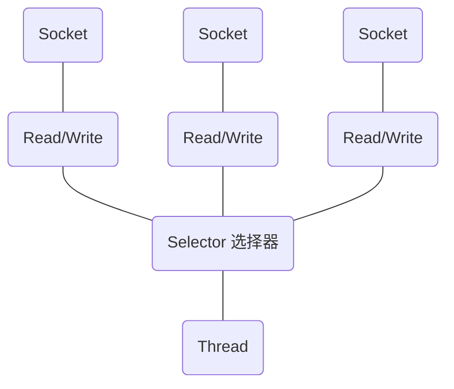

##### Selector 类相关方法
Selector类的相关方法：
Selector是一个抽象类，常用方法和说明如下：  
public abstract class Selector implements Closeable{  
&nbsp;&nbsp;&nbsp;&nbsp;public static Selector open();//得到一个选择器对象  
&nbsp;&nbsp;&nbsp;&nbsp;public int select(long timeout);//监控所有注册通道，当其中有i/o操作可以进行时，将对应的SelectionKey加入到
内部集合中并返回，参数用来设置超时时间。  
&nbsp;&nbsp;&nbsp;&nbsp;public Set<SelectionKey> selectedKeys() //从内部集合中得到所有的SelectionKey   
}

##### 注意事项
1）NIO中的ServerSocketChannel 功能类似SeverSocket， SocketChannel功能类似Socket。  
2）selector相关方法说明：  
selector.select()//阻塞  
selector.select(1000)//阻塞1000毫秒，在1000毫秒后返回  
selector.wakeup()// 唤醒selector
selector.selectNow()// 不阻塞，立马返回

##### NIO非阻塞网络编程原理分析图

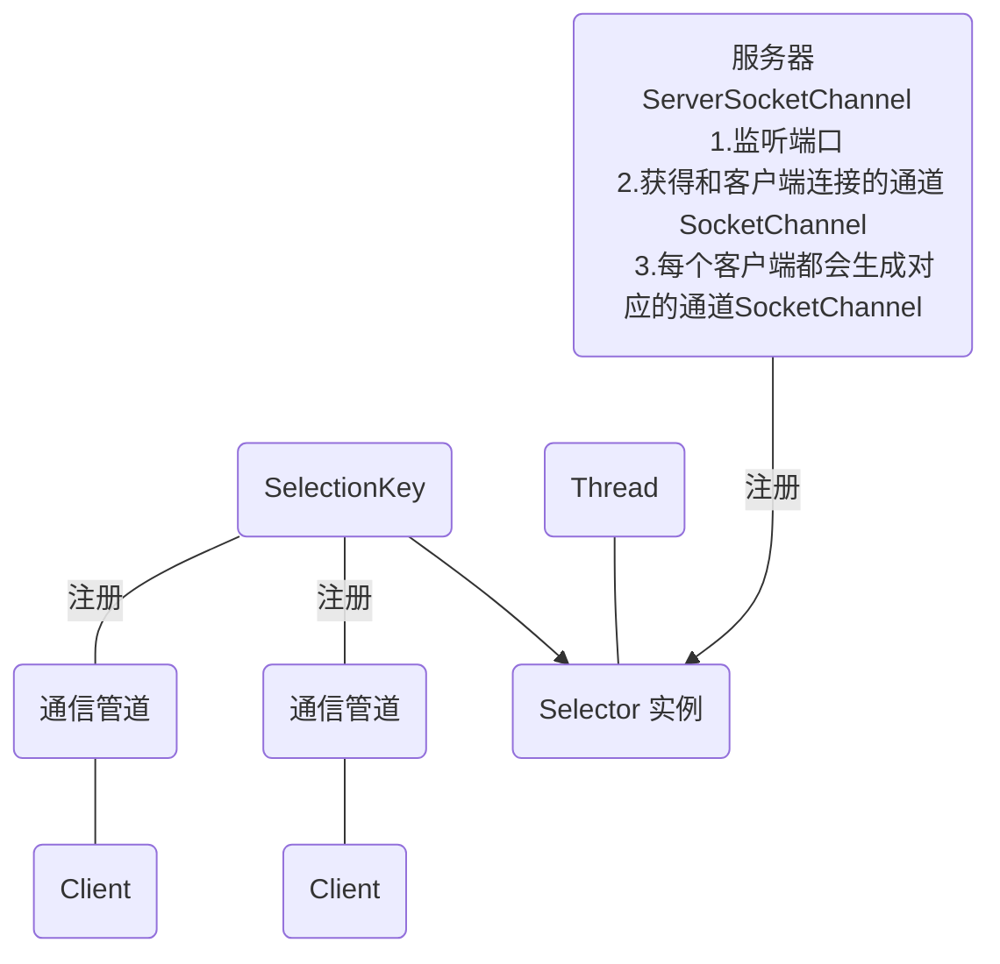

1）当客户端连接时，会通过ServerSocketChannel得到SocketChannel  
2）将SocketChannel注册到selector上，register(Selector sel, int ops), 一个selector上可以注册多个
SocketChannel  
3）注册后返回一个SelectionKey和该Selector关联（集合）  
4）Selector进行监听， select方法，返回有事件发生的通道个数。  
5）进一步得到各个SelectionKey（有事件发生）  
6）通过SelectionKey反向获取SocketChannel，方法channel()  
7）可以通过得到的Channel， 完成业务处理  


#### NIO 群聊系统实现
实例要求：
1）编写一个NIO群聊系统，实现服务器端和客户端之间的数据简单通讯（非阻塞）
2）实现多人群聊
3）服务器端可以检测用户上线，离线，并实现消息转发功能
4）客户端：通过channel可以无阻塞发送消息给其他所有用户，同时可以接受其他用户发送的消息（由服务器转发得到）
5）目的：进一步理解NIO非阻塞网络编程。

[GroupChatServer](./src/main/java/com/netty/demo/nio/groupchat/GroupChatServer.java)
[GroupChatClient](./src/main/java/com/netty/demo/nio/groupchat/GroupChatClient.java)

### NIO与零拷贝
零拷贝：零拷贝是指计算机执行IO操作时，CPU不需要将数据从内核空间拷贝到用户空间（不需要从KB拷贝到UB），
从而可以减少上下文切换以及CPU的拷贝时间。它是一种I/O操作优化技术。  

a.零拷贝，是从操作系统的角度来说的, 就是内核缓冲区之间没有数据是重复的（只有kernel buffer有一份数据）。  
b.零拷贝不仅带来更少的数据复制，还能带来其他的性能优势，例如更少的上下文切换，更少的CPU缓存伪共享以及无CPU校验和计算。  

1）零拷贝是网络编程的关键，很多性能优化都离不开  
2）在java程序中，常用的零拷贝有mmap（内存映射）和senFile。  
3）NIO中的零拷贝  

#### 传统IO数据读写
**概念：**
Hard Drive（HD）:  
DMA copy(DMA): Direct memory access  直接内存拷贝（不使用CPU）。首先从硬盘拷贝到内核缓冲  
kernel buffer(KB):  
CPU copy(CPU):  
user buffer(UB):  
socket buffer(SB):  
protocol engine(PE):  
1）传统IO的一段代码
```java


File file = new File("test.txt");
RandomAccessFile raf = new RandomAccessFile(file, "rw");

byte[] arr = new byte[(int)file.length()];
raf.read(arr);

Socket socket = new ServerSocket(8080).accept();
socket.getOutputStream().write(arr);
```
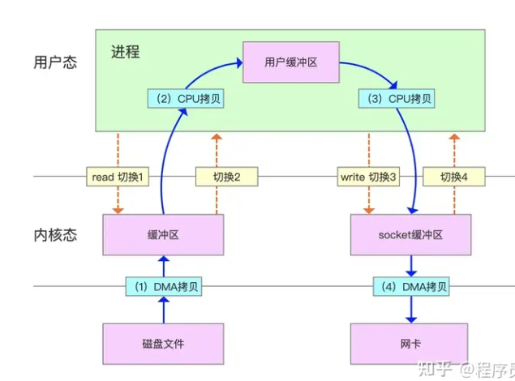
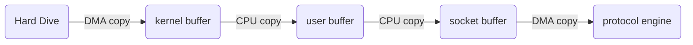

#### mmap优化
1）mmap通过内存映射，将文件映射到内存缓冲区，同时用户空间可以共享内核空间的数据。这样，在进行网络传输时，就可以减少
内核空间到用户空间的拷贝次数。

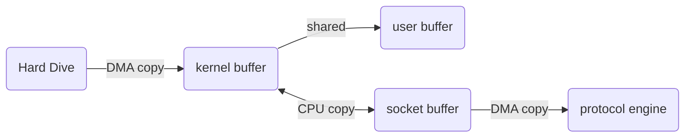

#### sendFile优化
1）linux2.1 版本提供了sendFile函数：数据根本不需要经过用户态，直接从内核缓冲区进入到Socket Buffer，同时
由于和用户态完全无关，就减少了一次上下文切换。
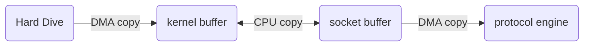
2）linux 2.4 版本中，做了一些修改，避免了从内核缓冲区拷贝到Socket buffer的操作，直接拷贝到协议栈，从而再一次减少了数据拷贝,
这里实际上还是存在kernel buffer到socket buffer 的CPU 拷贝，拷贝的信息很少，比如length，offset，消耗低，可以忽略。
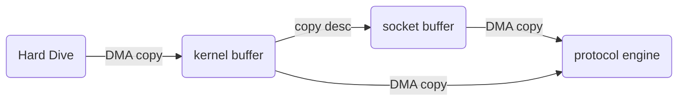

#### mmap 和senFile的区别
1）mmap适合小数据读写，sendFile适合大文件的传输    
2）mmap需要四次上下文切换，3次数据拷贝；sendFile需要3次上下文切换，最少2次数据拷贝。  
3）senFile可以利用DMA方式，减少CPU拷贝，mmap不能（必须从内核拷贝到缓冲区）  

#### NIO零拷贝案例
```java


```


### Java AIO基本介绍
1）JDK 7引入了Asynchronous I/O， 即AIO。在进行I/O编程中常用到两种模式： Reactor和Proactor。Java NIO 就是Reactor，当有事件触发时，服务端得到通知进行相应的处理。
2）AIO即NIO2.0，叫做异步不阻塞IO。 AIO引入异步通道概念，采用了Proactor模式，简化了程序编写，有效的请求才启动线程，他的特点是先由操作系统完成后才通知
服务端程序启动线程去处理，一般适用于连接数较多且连接时间较长的应用。
3）目前AIO还没有广泛应用，Netty也是基于NIO，而不是AIO。

## BIO NIO AIO对比表
| |BIO|NIO|AIO|
|---|---|---|---|
|IO模型|同步阻塞|同步非阻塞（多路复用）|异步非阻塞|
|编程难度|简单|复杂|复杂|
|可靠性|差|好|好|
|吞吐量|低|高|高|


# Netty概述
## 原生NIO存在的问题
1）NIO的类库和API复杂，使用麻烦。
2）需要具备其他额外技能：要熟悉java多线程编程，因为NIO编程涉及到Reactor模式。
3）开发工作量和难度都非常大：例如客户端面临断连重连、网络闪断、半包读写、失败缓存、网络拥塞和异常流的处理等等。
4）JDK NIO的bug：例如臭名昭著的Epoll Bug，他会导致Selector空轮询，最终导致CPU 100%。直到JDK 1.7 版本依旧存在，没有得到根本解决。

## Netty的优点
Netty对JDk自带的NIO的API进行了封装，解决了上述问题：
1）设计优雅：适用于各种传输类型的统一API阻塞和非阻塞Socket；基于灵活且可扩展的事件模型，可以清晰的分离关注点；高度可定制的线程模型-单线程，一个或多个线程池。
2）使用方便：详细记录的Javadoc，没有其他依赖项
3）高性能、吞吐量更高：延迟更低减少资源消耗；最小化不必要的内存复制。
4）安全：完整的SSL/TLS和StartTLS支持。
5）社区活跃、不断更新：社区活跃、版本迭代周期短，发现bug可以被及时修复，同时更多的新功能会被加入。

## Netty的线程模型设计
### 线程模型基本介绍
1）不同的线程模式，对程序的性能有很大的影响  
2）目前存在的线程模型：传统阻塞I/O服务模型， Reactor模式  
3）根据Reactor的数量和处理资源池线程的数量不同，有三种典型的实现：  
* 单Reactor单线程
* 单Reactor多线程
* 主从Reactor多线程
4）Netty线程模式（Netty主要基于主从Reactor多线程模型做了一定的改进，其中主从Reactor多线程模型有多个Reactor）
  
#### 传统阻塞IO服务模型示意图
**工作原理图**
黄色的框表示对象，蓝色的框表示线程，白色的框表示方法（API）

**模型特点**
1）采用阻塞IO模式获取输入的数据
2）每个链接都需要独立的线程完成数据的输入，业务处理，数据返回

**存在的问题分析**
1）当并发数很大，就会创建大量的线程，占用很大的系统资源
2）连接创建后，如果当前线程暂时没有数据可读，该线程会阻塞在read操作，造成线程资源浪费。

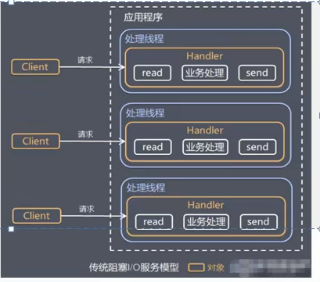

#### Reactor模式
针对传统IO服务模型的两个缺点，解决方案：  
1）基于IO复用模型：多个连接共用一个阻塞对象，应用程序只需要在一个阻塞对象等待，无需阻塞等待所有连接。当某个链接有新的数据可以处理时，
操作系统通知应用程序，线程从阻塞状态返回，开始进行业务处理。  
2）基于线程池复用线程资源：不必再为每个链接创建线程，将连接完成后的业务处理任务分配给线程进行处理，一个线程可以处理多个连接任务。  

**Reactor 模式示意图**
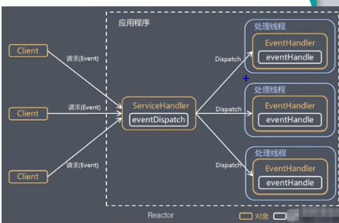

I/O复用结合线程池，就是Reactor模式基本设计思想：  
1）Reactor模式，通过一个或多个输入同事传递给服务处理气的模式（基于事件驱动）  
2）服务器端程序处理传入的多个请求，并将他们同步分排到相应的处理线程，因此Reactor模式也叫Dispatcher模式。  
3）Reactor模式使用IO复用监听事件，收到事件后，分发给某个线程（进程），这点就是网络服务器高并发处理的关键。  

#### Netty模型示意图


##### Reactor模式的核心组成
1）Reactor：Reactor在一个单独的线程中运行，负责监听和分发事件，分发给适当的处理程序来对IO事件做出反应。就像电话接线员，
它接听到来自客户的电话并将线路转移到适当的联系人。  
2）Handlers：处理程序执行IO事件要完成的实际事件，Reactor通过调度适当的处理程序来相应IO事件，处理程序执行非阻塞操作。  

##### 单Reactor单线程

1）Select是前面IO复用模型介绍的标准网络编程API，可以实现应用程序通过一个阻塞对象监听多路连接请求。
2）Reactor对象通过Select监控客户端请求事件，收到事件后通过Dispatch进行分发。
3）如果是建立连接请求的事件，则由Acceptor通过Accept处理连接请求，然后创建一个Handler对象处理连接完成后的后续业务处理。
4）如果不是建立连接时间，则Reactor会分发调用连接对应的Handler来响应。
5）Handler会完成Read->业务处理->Send 的完整业务流程。

**方案的优缺点：**  
1）优点：模型简单，没有多线程、进程通信、竞争问题，全部都在一个线程中完成。  
2）缺点：性能问题，只有一个线程，无法完全发挥多核CPU的性能。Handler在处理某个连接上的任务时，整个进程无法处理其他连接事件，
很容易导致性能瓶颈。  
3）缺点：可靠问题，线程意外终止，或者进入死循环，会导致整个系统通信模块不可用，不能接收和处理外部信息，造成节点故障。  
4）使用场景：客户端的数量有限，业务处理非常快速，比如Redis的业务处理时间复杂度为O(1)的情况。  

##### 单Reactor多线程
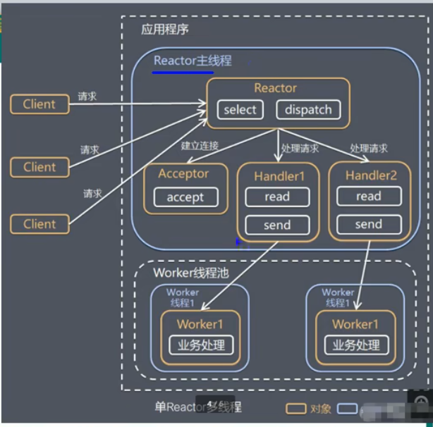
1）Reactor对象通过select监控客户端请求事件，收到事件后，通过dispatch完成分发。  
2）如果是建立连接的请求，则Acceptor通过accept处理链接请求，然后创建一个Handler对象处理完成连接后的各种事件。  
3）如果不是连接请求，则由reactor分发调用连接对应的handler来处理。  
4）handler只负责相应事件，不做具体的业务处理，通过read读取数据后，会分发给后面的worker线程池的某个线程处理业务。  
5）worker线程池会分配独立线程完成真正的业务，并将结果返回给handler。  
6）handler收到响应后，通过send将结果返回给client。  

__方案的优缺点：__  
1）优点：可以充分利用多核CPU的处理能力。      
2）缺点：多线程数据共享和访问比较复杂，reactor处理所有的事件的监听和响应， reactor对象本身在单线程运行，在高并发场景容易出现性能瓶颈。


##### 主从Reactor多线程
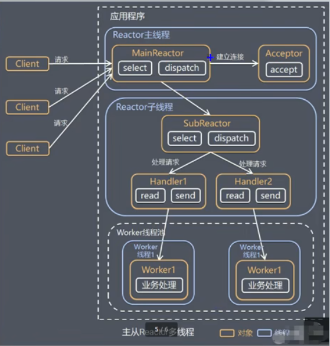
**背景**
针对单Reactor多线程模型中，Reactor在单线程中运行，高并发场景下容易成为性能瓶颈，可以让reactor在多线程中运行。   
1）Reactor主线程MainReactor对象通过select监听连接事件，收到事件后，通过acceptor处理连接事件。  
2）当Acceptor处理连接事件后，MainReactor将连接分配给SubReactor。  
3）subReactor将连接加入到连接队列进行监听，并创建handler进行各种事件处理。  
4）当有新事件发生时，subreactor就会调用对应的handler进行处理。  
5）handler通过read读取数据，分发给后面的worker线程进行处理。  
6）worker线程池会分配独立的worker线程进行业务处理，并返回结果给handler。  
7）handler收到响应结果后，在通过send奖结果返回给clieant。  
8）Reactor主线程可以对应多个reactor子线程，即MainReactor可以关联多个SubReactor。  

__方案的优缺点：__  
1）优点：父线程和子线程的数据交互简单职责明确，父线程只需要接收新连接，子线程完成后续的业务处理。  
2）优点：父线程和子线程的数据交互简单，Reactor主线程只需要把新链接传给子线程，子线程无需返回数据。  
3）缺点：编程复杂度高。  
结合实例：这种模型在许多项目中广泛使用，包括Nginx主从Reactor多进程模型，Memcached主从多线程，Netty主从多线程模型的支持。  


<br/>
<br/>


<table>
  <tr>
    <th>标题1</th>
    <th>标题2</th>
  </tr>
  <tr>
    <td>内容1</td>
    <td>内容2</td>
  </tr>
</table>

```java 
# 这是一个代码示例 
    // fileChannel 本地文件写数据
    public static void main(String[] args) throws IOException {
        String str = "Hello, World!";

        // 创建一个输出流-》channel
        FileOutputStream fileOutputStream = new FileOutputStream(new File("netty/src/main/java/com/netty/demo/nio/channel/file01.txt"));

        // 通过fileOutputStream 获取一个fileChannel
        FileChannel fileChannel = fileOutputStream.getChannel();
        // 创建一个缓冲区
        ByteBuffer byteBuffer = ByteBuffer.allocate(1024);
        // 将str放到byteBuffer
        byteBuffer.put(str.getBytes());
        //将byteBuffer进行flip
        byteBuffer.flip();
        // 将byteBuffer数据写入到fileChannel
        fileChannel.write(byteBuffer);
        fileOutputStream.close();
    }

```

[FileChannel01](./src/main/java/com/netty/demo/nio/channel/FileChannel01.java)


