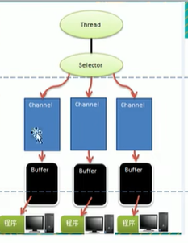
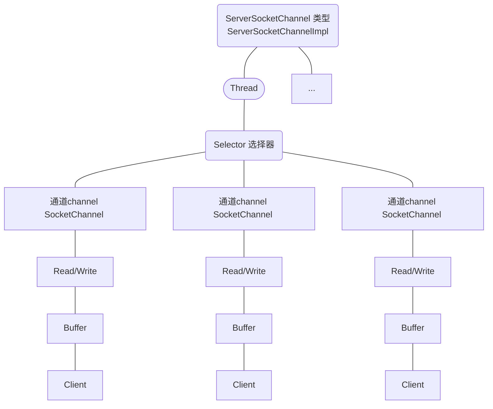

# 什么是Netty
## 前置要求
掌握了java OOP、java多线程编程、 java io编程、java网络编程， 常用的设计模式（比如观察着模式，命令模式，职责链模式）、
常用的数据结构（比如， 链表）

## netty是什么
1）JBOSS提供的一个java开源框架
2）是一个异步的、基于事件驱动的网络应用框架，用于快速开发高性能、高可靠性的网络io程序   
3）主要针对在tcp协议下，面向clients端的高并发应用，或者p2p场景下的大量数据持续传输的应用  
4）Netty本质是一个NIO框架，适用于服务器通讯相关的多种应用场景

## netty 应用场景
1)互联网行业：分布式系统中，各个节点之间需要远程服务调用，高性能的rpc框架必不可少，netty作为异步高性能的通信框架，往往作为基础通信组件被这些rpc框架调用  
2）典型应用：阿里分布式服务框架Dubbo的rpc框架使用Dubbo协议进行节点间的通信，Dubbo协议默认使用netty作为基础通信组件，用于实现各个进程节点间的通信  
3）Netty作为高性能的基础通信组件，提供了tcp/udp和http协议栈，方便定制和开发私有协议栈，账号登录服务器  
4）游戏服务器和地图服务器之间也会有所应用  
5）经典的hadoop的高性能通信和序列化组件（avro实现数据文件共享）的rpc框架，默认采用netty作为跨界点通信  

## 什么是IO模型
### java io模型
1）I/O模型简单理解：就是用什么样的通道进行数据的发送和接收，很大程度上决定了程序通信的性能
2）java总共支持三种网络编程I/O模式： BIO、NIO、AIO  
3）BIO： 同步并阻塞（传统阻塞性），服务器实现模式为一个连接一个线程，即客户端有链接请求时服务器端就需要启动一个线程进行处理，
如果链接不做任何事情会造成不必要的线程开销。  
4）NIO：同步非阻塞，服务器实现模式为一个线程处理多个请求（连接），即客户端发送的连接请求都会注册到多路复用器（selector）上，多路复用器轮询到连接有
I/O请求就进行处理。  
5）AIO：异步非阻塞，AIO引入异步通道的概念，采用reactor模式，简化了程序编写，有效的请求才启动线程，他的特点是先由操作系统完成后才通知
服务器端程序启动线程去处理，一般适用于连接数目较多且连接时间长的应用。

### 各个io模型适用的场景分析
1）BIO方式适用于连接数目小且固定的架构，种种方式对服务器资源要求比较高，并发局限于应用中，jdk1.4以前的唯一选择，但程序简单易理解。
2）NIO方式适用于连接数目多且连接比较短的架构，比如聊天服务器，弹幕系统，服务器间通讯等，编程比较复杂，jdk1.4开始支持。
3）AIO方式适用于连接数目较多且连接时间长的架构，比如相册分类器，充分调用os参与并发操作，编程比较复杂，jdk7开始支持。

### Java Bio基本介绍
传统的Java io编程，相关的类和接口在java.io中
#### bio 问题分析
1）每个请求都需要创建独立的线程，与对应的客户端进行数据read，业务处理，数据write  
2）当并发数较大是，需要创建大量的线程来处理链接，系统资源占用较大  
3）连接建立后，如果当前线程暂时没有数据可读，则线程就阻塞在read操作上，造成线程资源浪费 

### Java Nio基本介绍
1）java nio全称java non-blocking io，从jdk1.4开始，java提供了一系列改进的输入/输出的新特性
，被统称为NIO，是同步非阻塞  
2）NIO的类被放在java.nio包以及其子包下，并对java.io包下的很多类进行了改写。  
3）NIO有三大核心部分： Channel， Buffer， Selector  
4）NIO是面向缓冲区， 或者面向块编程的。数据读取到一个它稍后会处理的缓冲区，需要时可在缓冲区中前后移动，
这就增加了处理过程的灵活性，使用它可以提供非阻塞式的高伸缩性网络。  
5）java nio的非阻塞模式，使得一个线程从某通道发送请求或者读取数据，但是它仅能得到目前可用的数据，如果目前没有数据可用时，就什么都不会获取
，而不是保持线程阻塞，所以直至数据变得可以读取之前，该线程可以做其他事情，非阻塞写也是如此，一个线程请求写入数据到某个通道，但不需要等待他 
   完全写入，这个线程同时可以去做别的事情  
6）通俗理解：NIO可以做到用一个线程来处理多个操作的。假设10000个请求过来，根据实际情况，可以分配50或者100个线程来处理。不像之前的阻塞io
那样，非得分配10000个  
7）HTTP2.0 使用多路复用技术，做到同一个链接并发处理多个请求，而且并发请求的数量比HTTP1.1大了好几个数量级  

### 和BIO比较
1）bio是以流的方式处理数据，而nio以块的方式处理数据，块io比流io效率高很多  
2）bio是阻塞的，nio是非阻塞的  
3）bio基于字节流和字符流进行操作，而nio基于channel和buffer进行操作，数据总是从通道读取到缓冲区中，或者
从缓冲区写入通道。selector用于监听多个通道的事件（比如：连接请求、数据到达等），因此使用单个线程就可以监听多个客户端
通道

### NIO的三大核心组件原理示意图
  
* 每个channel都会对应一个buffer
* selector对应一个线程，一个线程对应多个channel的连接
* 该图反映了三个channel注册到该selector程序
* 程序切换到那个channel是由事件决定的， event是一个很重要的概念
* selector会根据不同的事件，在各个通道上切换
* buffer就是一个内存块，底层是有一个数组
* 数据的读取写入是通过buffer，这个和bio有不同， bio中要么是输入流，或者是输出流。但是nio的buffer可以读也可以写，需要flip方法进行切换。
* channel是双向的，可以返回底层操作系统的情况，比如linux，底层的操作系统通道就是双向的



#### NIO的Buffer
缓冲区（buffer）: 缓冲区本质上是一个可以读写数据的内存块，可以理解成一个容器对象（含数组），该对象提供了一组方法，可以更轻松的
使用内存块，缓冲区内置了一些机制，能够跟踪和记录缓冲区的状态变化情况。Channel提供从文件、网络读取数据的渠道，但是读取或写入数据都必须
经过Buffer：  
NIO程序 <--data--> 缓冲区 <--channel--> 文件

##### Buffer类及其子类
1）在NIO中，Buffer是一个顶层父类，它是一个抽象类。常用子类（ByteBuffer，ShortBuffr， CharBuffer，IntBuffer等）  
2）Buffer类定义了所有的缓冲区都具有四个属性来提供关于其所包含的数据元素的信息：capacity，limit，position， mark  
3）ByteBuffer：最常用的子类。

#### NIO的Channel
1）BIO中的stream是单向的，例如FileInputStream对象只能进行读取数据的操作，而NIO中的通道（Channel）是双向的，可以读操作，也可以写操作。  
2）Channel在NIO中是一个接口。   
3）常用的Channel类有：FileChannel、DatagramChannel、ServerSocketChannel和SocketChannel，  
4）FileChannel用于文件数据读写，DatagramChannel用于UDP的数据读写，ServerSocketChannel和SocketChannel用于TCP数据读写。  

#### 关于Buffer和Channel的注意事项和细节
1）ByteBuffer支持类型化的put和get， put放入什么数据类型，get就应该使用相应的数据类型取出，否则可能有BufferUnderflowException异常。
2）可以将一个普通buffer转成只读buffer
3）NIO还提供了MappedByteBuffer，可以让文件直接在内存（堆外的内存）中进行修改，而如何同步到文件由NIO来完成
4）NIO还支持通过多个Buffer（即Buffer数组）完成读写操，即Scattering和Gatering


```java 
# 这是一个代码示例 
    // fileChannel 本地文件写数据
    public static void main(String[] args) throws IOException {
        String str = "Hello, World!";

        // 创建一个输出流-》channel
        FileOutputStream fileOutputStream = new FileOutputStream(new File("netty/src/main/java/com/netty/demo/nio/channel/file01.txt"));

        // 通过fileOutputStream 获取一个fileChannel
        FileChannel fileChannel = fileOutputStream.getChannel();
        // 创建一个缓冲区
        ByteBuffer byteBuffer = ByteBuffer.allocate(1024);
        // 将str放到byteBuffer
        byteBuffer.put(str.getBytes());
        //将byteBuffer进行flip
        byteBuffer.flip();
        // 将byteBuffer数据写入到fileChannel
        fileChannel.write(byteBuffer);
        fileOutputStream.close();
    }

```

[FileChannel01](./src/main/java/com/netty/demo/nio/channel/FileChannel01.java)


