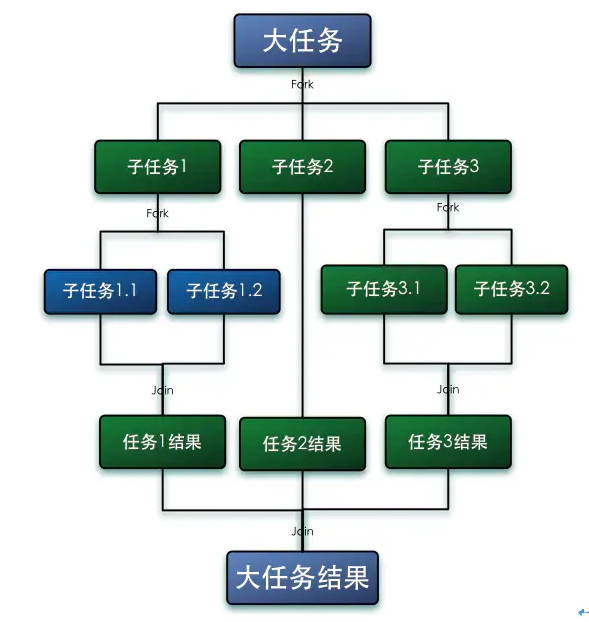

# Pool 技术
## ThreadPoolExecutor
todo: 学习并写一个sample
七个核心参数 
拒绝策略

## ForkJoinPool
ForkJoinPool 是 JDK7 引入的，由 Doug Lea 编写的高性能线程池。核心思想是将大的任务拆分成多个小任务（即fork），
然后在将多个小任务处理汇总到一个结果上（即join），非常像MapReduce处理原理。同时，它提供基本的线程池功能，
支持设置最大并发线程数，支持任务排队，支持线程池停止，支持线程池使用情况监控，也是AbstractExecutorService的子类，
主要引入了“工作窃取”机制，在多CPU计算机上处理性能更佳。其广泛用在java8的stream中。  
  
ForkJoinPool 并不是为了替代 ThreadPoolExecutor 而出现的，而是作为一种它的补充。在处理 CPU 密集型任务的时候，
它的性能比 ThreadPoolExecutor 更好，而如果你是 I/O 密集型任务的时候，除非配置 ManagedBlocker 一起使用，否则不建议使用它。

分治法的基本思想是一个规模为N的问题分解为K个规模较小的子问题，这些子问题的相互独立且与原问题的性质相同，求出子问题的解之后，将这些解合并，
就可以得到原有问题的解

### 工作窃取
工作窃取是指当某个线程的任务队列中没有可执行任务的时候，从其他线程的任务队列中窃取任务来执行，以充分利用工作线程的计算能力，
减少线程由于获取不到任务而造成的空闲浪费。