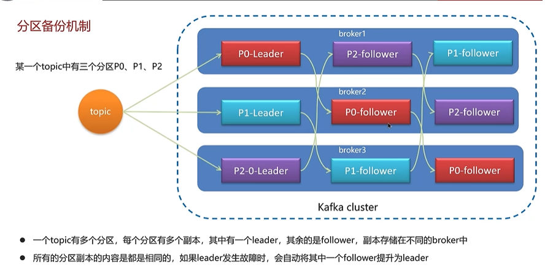

# <span id="java">Java</span>
## Java Base
### 内存分区

### 垃圾收集器

### java内存模型

### java 进程间的通讯方式
使用ProcessBuilder启动子进程.  
使用Socket进行网络通信。  
使用Java RMI（远程方法调用）。  
使用JMS（Java Message Service）。  
使用Files或MappedByteBuffer进行文件映射。  
使用System.in, System.out, System.err进行父子进程间通信。  
使用中间件，消息队列，数据库等。  


## <span id="juc">JUC</span>
### Pool 技术
池话设计应该不是一个新名词。我们常见的如java线程池、jdbc连接池、redis连接池等就是这类设计的代表实现。这种设计会初始预设资源，解决的问题就是抵消
每次获取资源的消耗，如创建线程的开销，获取远程连接的开销等。就好比你去食堂打饭，打饭的大妈会先把饭盛好几份放那里，你来了就直接拿着饭盒加菜即可，
不用再临时又盛饭又打菜，效率就高了。除了初始化资源，池化设计还包括如下这些特征：池子的初始值、池子的活跃值、池子的最大值等，这些特征可以直接映射到java线
程池和数据库连接池的成员属性中。

#### [java 线程池](#java)
Java线程池是多线程编程中一项重要的工具，它能够有效地管理和调度线程，提高程序的并发性能。线程池的扩容机制是线程池的关键特性之一，
它允许根据工作负载的变化动态地增加或减少线程数量。

##### 线程池主要参数
线程池的主要参数：  
corePoolSize（核心线程数）：线程池中一直存活的线程数量，即使它们处于空闲状态也不会被销毁。  
maximumPoolSize（最大线程数）：线程池中允许的最大线程数量，包括空闲状态的线程和正在执行任务的线程。  
workQueue（工作队列）：存放等待执行的任务的队列。当任务提交到线程池时，会先放入工作队列。  
keepAliveTime（线程空闲时间）：空闲线程的最大存活时间，超过这个时间空闲线程将被销毁，仅当线程数量超过核心线程数时生效。  
RejectedExecutionHandler（任务拒绝处理器）：当任务无法被执行时的处理策略。

##### [线程池拒绝策略][拒绝策略]
拒绝策略都是主线程去执行的。  
内置的四种拒绝策略：  
1)[CallerRunPolicy（调用者运行策略)](#reject1)  
2)[AbortPolicy（中止策略)](#reject2)  
3)[DiscardPolicy（丢弃策略）](#reject3)  
4)[DiscardOldestPolicy（弃老策略）](#reject4)

**拒绝策略顶层接口**
```java
public interface RejectedExecutionHandler {
    void rejectedExecution(Runnable r, ThreadPoolExecutor executor);
}
```
1）<span id="reject1">CallerRunPolicy（调用者运行策略)</span>
功能：当触发拒绝策略时，只要线程池没有关闭，就由提交任务的当前线程处理。  

使用场景：一般在不允许失败的、对性能要求不高、并发量较小的场景下使用，因为线程池一般情况下不会关闭，也就是提交的任务一定会被运行，但是由于是调用者
线程自己执行的，在线程池满载的情况下多次提交任务时，就会阻塞后续任务执行，性能和效率自然就慢了。
```java

public static class CallerRunsPolicy implements RejectedExecutionHandler {
    public CallerRunsPolicy() { }
    public void rejectedExecution(Runnable r, ThreadPoolExecutor e) {
        if (!e.isShutdown()) {
            r.run();
        }
    }
}
```

2）<span id="reject2"> AbortPolicy（中止策略）</span>
功能：当触发拒绝策略时，直接抛出拒绝执行的异常，中止策略的意思也就是打断当前执行流程  
使用场景：这个就没有特殊的场景了，但是一点要正确处理抛出的异常。ThreadPoolExecutor中默认的策略就是AbortPolicy，
ExecutorService接口的系列ThreadPoolExecutor因为都没有显示的设置拒绝策略，所以默认的都是这个。但是请注意，ExecutorService中的线程池实例
队列都是无界的，也就是说把内存撑爆了都不会触发拒绝策略。当自己自定义线程池实例时，使用这个策略一定要处理好触发策略时抛的异常，因为他会打断当前的执行流程。
```java
public static class AbortPolicy implements RejectedExecutionHandler {
        public AbortPolicy() { }
        public void rejectedExecution(Runnable r, ThreadPoolExecutor e) {
            throw new RejectedExecutionException("Task " + r.toString() +
                                                 " rejected from " +
                                                 e.toString());
        }
    }
```

3)<span id="reject3"> DiscardPolicy（丢弃策略）</span>  
功能：直接静悄悄的丢弃这个任务，不触发任何动作
使用场景：如果你提交的任务无关紧要，你就可以使用它 。因为它就是个空实现，会悄无声息的吞噬你的的任务。所以这个策略基本上不用了
```java
public static class DiscardPolicy implements RejectedExecutionHandler {
        public DiscardPolicy() { }
        public void rejectedExecution(Runnable r, ThreadPoolExecutor e) {
        }
    }
```

3)<span id="reject4"> DiscardOldestPolicy（弃老策略）</span>  
功能：如果线程池未关闭，就弹出队列头部的元素，然后尝试执行
使用场景：这个策略还是会丢弃任务，丢弃时也是毫无声息，但是特点是丢弃的是老的未执行的任务，而且是待执行优先级较高的任务。基于这个特性，我能想到的场
景就是，发布消息，和修改消息，当消息发布出去后，还未执行，此时更新的消息又来了，这个时候未执行的消息的版本比现在提交的消息版本要低就可以被丢弃了。
因为队列中还有可能存在消息版本更低的消息会排队执行，所以在真正处理消息的时候一定要做好消息的版本比较.

```java
public static class DiscardOldestPolicy implements RejectedExecutionHandler {
    public DiscardOldestPolicy() { }
    public void rejectedExecution(Runnable r, ThreadPoolExecutor e) {
        if (!e.isShutdown()) {
            e.getQueue().poll();
            e.execute(r);
        }
    }
}
```

#### <a href="#label">ForkJoinPool</a>
ForkJoinPool 是 JDK7 引入的，由 Doug Lea 编写的高性能线程池。核心思想是将大的任务拆分成多个小任务（即fork），
然后在将多个小任务处理汇总到一个结果上（即join），非常像MapReduce处理原理。同时，它提供基本的线程池功能，
支持设置最大并发线程数，支持任务排队，支持线程池停止，支持线程池使用情况监控，也是AbstractExecutorService的子类，
主要引入了“工作窃取”机制，在多CPU计算机上处理性能更佳。其广泛用在java8的stream中。

ForkJoinPool 并不是为了替代 ThreadPoolExecutor 而出现的，而是作为一种它的补充。在处理 CPU 密集型任务的时候，
它的性能比 ThreadPoolExecutor 更好，而如果你是 I/O 密集型任务的时候，除非配置 ManagedBlocker 一起使用，否则不建议使用它。


分治法的基本思想是一个规模为N的问题分解为K个规模较小的子问题，这些子问题的相互独立且与原问题的性质相同，求出子问题的解之后，将这些解合并，
就可以得到原有问题的解


##### 工作窃取
工作窃取是指当某个线程的任务队列中没有可执行任务的时候，从其他线程的任务队列中窃取任务来执行，以充分利用工作线程的计算能力，
减少线程由于获取不到任务而造成的空闲浪费。

### 虚拟线程

**什么是 Java 虚拟线程？**
Java 虚拟线程是指一种在 Java 虚拟机（JVM）中实现的轻量级线程，也被称为用户线程。  
和传统操作系统线程相比，Java 虚拟线程的创建和销毁速度更快，开销更小，可以大量创建，更适合轻量级任务场景。

虚拟线程在 Java 中的实现方式是通过协作式线程调度（Cooperative Thread Scheduling）来完成的。  
这种调度方式是将线程的执行权从（运行中的）线程主动交给另一个处于等待状态的线程，从而达到多个线程并发执行的目的。

Java 虚拟线程是由 Java 虚拟机自己管理的，而不是操作系统。  
JVM 每隔一段时间就会主动触发一次线程调度，将执行权交给其他线程，以便让等待执行的线程得到运行机会。

**应用场景**  
Java 虚拟线程广泛应用于轻量级任务场景，例如协议处理、IO 处理、计算密集型任务、GUI 事件监听等。其优势是可以针对大量的小型任务，
采用小的线程池或线程缓存来提高程序的效率和性能。

1.短时间的任务
Java 虚拟线程适用于短时间的任务，如网络通信、IO 操作等，这些任务通常很快就能够完成，不占用太多计算资源，但需要频繁切换线程。
在这种情况下，虚拟线程的轻量级特性可以有效地减少上下文切换的开销，提升程序的性能。

2.并行计算
Java 虚拟线程也可以用于并行计算，例如多线程计算中的 MapReduce 并行计算框架。在这种应用场景下，虚拟线程可以协同工作，对数据进行分布式处理，从而提高性能和效率。

3.GUI 事件监听
在 GUI 应用程序中，虚拟线程可以用于监听用户事件，如鼠标点击、键盘输入等。在这种应用场景下，虚拟线程通常不需要很高的计算性能，但需要能够及时响应用户的操作。虚拟线程因为轻量级，因此能够快速地相应用户的操作，并将处理结果返回给 GUI 应用程序。

**虚拟线程的优化**  
在虚拟线程应用的过程中，还需要关注线程的安全和优化问题，常见优化方式有以下几种：
1 线程池
线程池可以用来缓存线程资源，避免了线程的频繁创建和销毁，以及系统资源的浪费。在使用线程池时，需要保证线程的数量不会超出资源的限制，
否则会导致程序崩溃或者运行缓慢。

2 同步机制
多线程之间的访问和操作需要进行同步处理。在 Java 中，可以使用 synchronized 关键字来实现同步操作，避免出现线程竞争的问题。

3 线程间通信
线程间协同工作需要进行线程间通信，以便将工作结果返回给其他线程。Java 中提供了 wait/notify/notifyAll 等机制来进行线程间通信，
以便协同工作的线程能够及时响应和处理。


## Java面经
**1.《Java核心技术 卷I》静态内部类这一小节提到，“与常规内部类不同，静态内部类可以有静态字段和方法”。也就是常规内部类是不能有静态字段和方法的，为什么？**  
静态字段和方法在类加载的时候就会存在于内存中，但是外部类加载的时候并不会加载常规内部类。常规内部类只有在外部类实例化之后才加载，
而静态字段或方法是在类加载之后才存在的。如果在外部类还没有实例化的时候调用非静态内部类的静态字段或方法，内部类还没加载是不能创建静态字段或方法的。

因此，如果想在内部类中定义静态字段和方法，内部类本身也必须被声明为是静态的。
另外书中还注释了一句话：“在接口中声明的内部类自动是static和public。”。因为接口不能被实例化，可以将接口看做是一个抽象类，其中的方法没有具体实现
，因此不能通过实例化一个接口来加载内部类、创建内部类的对象。

**2.synchronized和volatile的区别**  
olatile和synchronized都是用于多线程编程的关键字，但它们在实现线程同步和保证数据可见性方面有所不同。以下是详细介绍：  

volatile关键字主要用于确保变量在多个线程之间可见，它通过内存屏障和禁止处理器重排序来保证这一点，volatile变量每次被线程读取时，
都会从主内存中重新加载最新值，而不会使用寄存器或工作内存中的缓存。volatile不保证原子性，
即它不能防止多个线程同时修改一个volatile变量的不同部分。  

synchronized关键字则用于更广泛的同步，它可以修饰方法、代码块或整个类。当一个线程执行synchronized代码时，它会获取一个锁，
这会阻止其他线程访问相同的代码块，直到锁被释放。synchronized不仅保证可见性，还保证原子性，即它确保代码块中的所有操作都是原子的，
不会被线程调度器重新排序。


**3、线程的生命周期**  


**4.什么是AQS**  
AbstractQueuedSynchronizer，即抽象队列同步器。他是构建锁或者其他同步组件的基础框架。    

| synchronized | AQS |
| :-----| ----: |
| java关键字， C++语言实现 | java语言实现 | 
| 悲观锁，自动释放 | 悲观锁，手动开启和关闭 |
|锁竞争激烈都是重量级锁| 锁竞争激烈的情况下，提供了多种解决方案|

AQS常见实现类：  
ReentrantLock、Semaphore、 CountdownLatch  

基本原理：  
锁状态变量：state（volatile的）  通过cas（底层是Unsafe类直接操作内存）设置state状态保证操作原子性  
队列：当获取锁冲突时，用于线程排队（有FIFO或其他）

**5、threadLocal可能造成的问题以及解决方案**  

**6.MyBatis一级、二级缓存**
一级缓存：作用域是session级别， 基于PerpetualCache，本质是一个HashMap。当Session进行flush或close之后，该session中所有的Cache就将清空，
默认打开一级缓存。  
二级缓存：作用域是namespace和mapper的作用域，不依赖于SQL session， 默认也是基于PerpetualCache，本质是一个HashMap，需要单独开启。

**6.MyBatis执行流程**  


**7.强软弱虚引用的概念和使用场景**  
‌强引用‌是最常见的引用类型，当一个对象被一个强引用引用时，垃圾回收器不会回收该对象，即使内存不足也不会回收。
强引用通常用于需要长时间存活的对象，如单例模式、缓存等‌12。  

‌软引用‌是一种相对较弱的引用类型，用于描述一些有用但并不是必需的对象。当内存不足时，
垃圾回收器会回收软引用关联的对象。软引用适用于实现缓存机制，如缓存数据或图片等，当内存不足时可以释放这些对象‌12。

‌弱引用‌比软引用更弱，无论内存是否足够，垃圾回收器都可能回收被弱引用关联的对象。弱引用适用于实现一些特定的功能
，如观察者模式，通常用于监视器对象的状态‌12。

‌虚引用‌是最弱的引用类型，当一个对象被虚引用引用时，该对象在任何时候都可能被垃圾回收器回收。
虚引用主要用于管理直接内存，在对象被回收时触发特定的清理操作，适用于对象池和线程池等高级对象生命周期管理‌12。

使用场景
‌强引用‌：适用于需要长时间存活的对象，如单例模式、缓存等。在并发编程中，强引用也用于保持线程安全共享的对象‌2。  
‌软引用‌：适用于缓存机制，如缓存数据或图片等。在内存不足时可以释放这些对象‌2。  
‌弱引用‌：适用于实现一些特定的功能，如观察者模式，通常用于监视器对象的状态‌2。  
‌虚引用‌：适用于对象池和线程池等高级对象生命周期管理，在对象被回收时触发特定的清理操作‌2。  


# Kubernate

# Nginx

# lightSpeed
jenkins docker udeploy
teckton harness


# Redis

## Redis 面经
**1、Redis实现分布式锁**  
如何基于 Redis 实现一个最简易的分布式锁？不论是本地锁还是分布式锁，核心都在于“互斥”。  
在 Redis 中， SETNX 命令是可以帮助我们实现互斥。
SETNX 即 SET if Not eXists (对应 Java 中的 setIfAbsent 方法)，如果 key 不存在的话，才会设置 key 的值。
如果 key 已经存在， SETNX 啥也不做。
>
>  SETNX lockKey uniqueValue  
>  SETNX lockKey uniqueValue
> 
释放锁的话，直接通过 DEL 命令删除对应的 key 即可。
>  DEL lockKey

为了防止误删到其他的锁，这里我们建议使用 Lua 脚本通过 key 对应的 value（唯一值）来判断。 选用 Lua 脚本是为了保证解锁操作的原子性。
因为 Redis 在执行 Lua 脚本时，可以以原子性的方式执行，从而保证了锁释放操作的原子性。  

为了避免锁无法被释放，我们可以想到的一个解决办法就是：给这个 key（也就是锁） 设置一个过期时间 。
> SET lockKey uniqueValue EX 3 NX
>
* lockKey：加锁的锁名；
* uniqueValue：能够唯一标识锁的随机字符串；  
* NX：只有当 lockKey 对应的 key 值不存在的时候才能 SET 成功；  
* EX：过期时间设置（秒为单位）EX 3 标示这个锁有一个 3 秒的自动过期时间。与 EX 对应的是 PX（毫秒为单位），这两个都是过期时间设置。 
  
一定要保证设置指定 key 的值和过期时间是一个原子操作！！！ 不然的话，依然可能会出现锁无法被释放的问题。这样确实可以解决问题，不过，这种解决办法同样存在漏洞：
如果操作共享资源的时间大于过期时间，就会出现锁提前过期的问题，进而导致分布式锁直接失效。如果锁的超时时间设置过长，又会影响到性能。

**2、Redis数据类型**  
string（字符串）: 基本的数据存储单元，可以存储字符串、整数或者浮点数。
hash（哈希）:一个键值对集合，可以存储多个字段。
list（列表）:一个简单的列表，可以存储一系列的字符串元素。
set（集合）:一个无序集合，可以存储不重复的字符串元素。
zset(sorted set：有序集合): 类似于集合，但是每个元素都有一个分数（score）与之关联。

# linux

## linux 面经
**1、查看线上日志的命令**  
（1）实时监控日志的变化  
实时监控某一日志文件的变化：tail -f xx.log；  
实时监控日志最后100行： tail -n 100 -f xx.log

（2）按照行号查询  
查询日志尾部最后100行： tail -n 100 xx.log  
查询日志头部开始100行： head -n 100 xx.log  
查询某一日志行号区间： cat -n xx.log | tail -n +100 | head -n 100 (查询100-200行的日志)

（3）按照关键字找日志的信息  
查询日志文件中包含debug 的日志行号： cat -n xx.log | grep "debug"

（4）按照日期查询  
sed -n '/2023-05-18 14:22:31.070/,/2023-05-19 14:22:31.070/p' xx.log

（5）日志太多的处理方式  
分页查询日志信息： cat -n xx.log| grep "debug"| more  
筛选过滤以后，输出到一个文件： cat -n xx.log| grep "debug" > debug.txt  


# Spark

# Hbase

# Zookeeper

# kafka
## kafka面经
**1.Kafka高效读盘写盘**  
Kafka 的消息是保存或缓存在磁盘上的，一般认为在磁盘上读写数据是会降低性能的，因为寻址会比较消耗时间，但是实际上，Kafka 的特性之一就是高吞吐率。Kafka 之所以能这么快，无非是：顺序写磁盘、大量使用内存页 、零拷贝技术的使用、批量发送、数据压缩。  

为了高效的写盘，Kafka使用了两种策略。  
(1) 追加写提高效率：Kafka是将partition的数据写在磁盘的(消息日志)，不过Kafka只允许追加写入(底层磁盘原理：顺序访问而不是随机访问，没有寻址时间，加快写入速度)，避免缓慢的随机 I/O 操作。  
(2) 攒一波一次写/批量写：Kafka也不是partition一有数据就立马将数据写到磁盘上，它会先缓存一部分，等到足够多数据量或等待一定的时间再批量写入(flush)。  

前面讲解到了生产者往topic里丢数据是存在partition上的，而partition持久化到磁盘是IO顺序访问的，并且是先写缓存，隔一段时间或者数据量足够大的时候才
批量写入磁盘的，即写盘的时候通过“顺序IO+批量写”达到最快写盘。  

在读的时候也很有讲究，通过零拷贝技术加快读盘速度，每个消费者通过offset记录自己的当前读取位置。  

零拷贝：正常的读磁盘数据是需要将内核态数据拷贝到用户态的，而Kafka 通过调用sendfile()直接从内核空间（DMA Direct Memery Access直接内存通过）到内核空间（Socket的），少做了一步拷贝的操作。  


**2.如何有序的消费不同分区的消息**  
1).kafka topic只设置一个partition分区。  
2).producer将消息发送到指定的分区。  
3).局部消费顺序：多个partition局部有序  

生产时：producer在把消息发送到partition的时候，当key非空时，用key的hash值对partition个数取模，决定要把消息发送到哪个partition上，
可以指定一样的key，这样这个key的消息在单个partition内是有序的。  
注：当key为空时，消息随机发送到各个分区。规则再各个版本会有不同，有的是采用轮询方式，有的随机，有的是一定时间内发送给固定的partition，隔一段时间后随机换一个。  
消费时：在一个消费者组中的多个消费者消费一个topic时，一个消费这组中只能有一个消费者消费该消息，topic下的每个分区只属于组中的一个消费者，因此是有序的。 

**2.如何有序的消费不同分区的消息**  
消息顺序性的场景：  
1）即时消息中的单对单聊天和群聊，保证发送方消息发送顺序和接收方的顺序一致。  
2）充值转账两个渠道在同一时间进行余额变更，短信通知必须要有顺序。  

解决方案：  
1）topic分区中消息只能由消费者组中的唯一一个消费者处理，所以消息肯定是按照先后顺序进行处理的。但是它也仅仅是保证Topic的一个分区  
顺序处理，不能保证跨分区的消息先后处理顺序。所以如果你想要顺序的处理Topic的所有消息，那就只能提供一个分区。  
2）发送消息的时候按照相同的业务设置相同的key，因为消息投递到topic后会按照key去计算hashCode得到对应的分区编号。


**3.Kafka如何保证消息不丢失**  
1）生产者发消息到broker丢失  
a.设置异步发送，设置回调函数，重写回调接口的onCompletion方法，打印消息发送失败情况的日志，及时跟踪发送消息丢失情况。  
b.kafka提供了消息重试机制的配置。  

2）消息在broker中存储丢失  
a.提供了发送确认机制acks
acks=0： 生产这成功写入消息之前不会等待任何来自服务器的响应，消息有丢失风险，但是速度最快。  
acks=1（默认值）：只要集群leader节点收到消息，生产者就会收到一个来自服务器的成功响应。  
acks=all：只有当所有参与存储消息的节点全部收到消息时，生产者才会收到一个来自服务器的成功响应。  


3）消费者从broker中接收消息丢失  
kafka 中的分区机制指的是将每个主题划分成多个分区，topic分区中的消息只能由消费者组中的唯一一个消费者处理，
不同的分区分配给不同的消费者（同一个消费组）  

消费者默认是自动按期提交已经消费的偏移量，默认是每隔5s提交一次，如果出现重平衡的情况，可能会出现重复消费或者丢失数据。  

重平衡： 分组内多个消费者消费不同的分区的情况下，如果其中一个消费者宕机了，这个时候会对对应的分区重新分配消费者，这个过程叫做重平衡。
如果宕机的时候，这个消费者提交偏移量失败，那么可能会导致重复消费，以及消息丢失的情况。

解决方案：  
关闭自动提交偏移量，开启手动提交偏移量，提交方式可以是下列方式，但是最好是同步+异步组合提交。  
a.同步提交  
b.异步提交    
c.同步+异步组合提交  

**4.Kafka高可用性有了解过吗**  
1）集群模式  
2）分区复制机制  



**5.Kafka数据清理机制**  

**6.Kafka高性能的设计**  
1）消息分区：不收单台服务器的限制，可以不受限的处理更多的数据。  
2）顺序读写： 磁盘顺序读写，提升读写效率。  
3）页缓存： 把磁盘的数据缓存到内存中，把对磁盘的访问变成对内存的访问。  
4）零拷贝：减少上下文切换及数据拷贝  


5）消息压缩：减少磁盘IO和网络IO  
6）分批发送：将消息打包批量发送，减少网络开销  


# Mysql
## 架构原理图


## 知识点
**1.索引**  
（1）覆盖索引  
概念：查询使用了索引，并且需要返回的列，在该索引已经全部能够找到。  
（2）聚簇索引和非聚簇索引（二级索引）  
聚集索引： 将数据存储和索引放到了一块，索引结构的叶子结点保存了行数据。必须有，而且只能有一个，比如：主键索引。
如果存在主键，主键就是聚集索引，否则将使用第一个UNIQUE 唯一索引作为聚集索引。若两者都没有，则innodb会自动生成一个
rowid作为隐藏的聚集索引。

非聚簇索引（二级索引）：将数据和索引分开存储，索引结构的叶子节点关联的是对应的主键，可以存在多个。


回表查询： 通过二级索引查到对应的主键以后，再回到聚集索引里面查询相关的数据记录。

**2.事务**  
MySQL中的事务‌是指一组数据库操作（如插入、更新、删除等），这些操作被视为一个单一的工作单元，要么全部成功提交（Commit），要么全部失败回滚（Rollback）。
事务确保了数据库的一致性和完整性，并且具有以下四个特性：

**原子性（Atomicity）** ‌：事务是一个不可分割的最小工作单元，要么全部执行，要么全部不执行。如果事务中的任何一部分操作失败，
整个事务将回滚到初始状态，数据库不会受到部分执行操作的影响‌。

**一致性（Consistency）** ‌：事务开始之前和结束之后，数据库必须保持一致性状态。这意味着事务在执行期间对数据进行的任何更改必须满足
事先定义的一组规则（约束条件、触发器等）。如果在事务执行期间违反了一致性约束，事务将回滚并丢弃所有修改‌1。

**隔离性（Isolation）** ‌：事务的隔离性确保同时运行的多个事务相互之间是隔离的，每个事务都认为它是在独立运行的。
通过隔离级别（如读未提交、读已提交、可重复读、串行化）来控制事务之间的隔离程度‌12。

**‌持久性（Durability）** ‌：一旦事务被提交，其所做的修改将永久保存在数据库中，并且在系统故障或崩溃发生时，
已提交的事务的修改也会持久保留‌12。

**事务的实现机制**  
事务的实现依赖于undo log日志。当事务执行更新操作之前，数据库会将当前数据行的旧值存储到undo log日志中。
如果事务执行过程中出现异常情况，数据库会利用undo log进行回滚操作，将数据恢复到事务开始前的状态‌3。

**并发事务可能产生的问题及隔离级别**   
并发事务可能导致以下问题：脏读、不可重复读和幻读。为了控制这些问题，MySQL提供了不同的隔离级别：  

**读未提交（Read Uncommitted）** ‌：最低的隔离级别，允许读取未提交的数据。这个时候出现脏读问题。    
**‌读已提交（Read Committed）** ‌：允许从已经提交的事务中读取数据，但可能遇到不可重复读的问题。会出现前后读取的同一条记录不一致的情况，一条数据
记录在事务处理过程中被别的事务修改了（update）    
**可重复读（Repeatable Read）** ‌：确保在同一个事务中多次读取同样的记录结果一致，但可能遇到幻读。幻读就是事务处理过程中，前后读取的数据记录条数不一致，中间
被别的事务插入（insert）记录了  
**‌串行化（Serializable）** ‌：最高的隔离级别，通过完全串行化地执行各个事务来避免脏读、不可重复读和幻读‌。

**3.主从复制**  
Mysql主从复制的核心就是二进制日志。  
BinLOG记录了所有的DDL（数据定义语言）语句和DML（数据操纵语言）语句，但不包括数据查询（SELECT、SHOW）语句。  
主从复制分为三步：  
1）Master主库在事务提交时，会把数据变更记录在二进制日志文件Binlog中。  
2）从库读取主库的二进制日志文件，写入到从库的中继日志（relay log）。  
3）slave重做中继日志中的事件，将改变反映到他自己的数据。


## Mysql面经
**1.如何解决深分页问题**  
场景：在数据量比较大时，如果进行limit分页查询，在查询时，越往后，分页查询效率越低。  
解决方案：   
（1）覆盖索引+子查询的方式  
一般分页查询时，通过创建覆盖索引能够比较好的提高性能，可以通过覆盖+子查询的方式进行优化  


**2.什么情况下索引会失效**  
执行explain查看sql执行计划，可以确认索引是否生效。  
1）违反最左前缀法则  
如果索引了多列，要遵守最左前缀法则。指的是查询从索引的最左前列开始，并且不跳过索引中的列，匹配最左前缀法则，走索引。  
2）范围查询右边的列，不能使用索引，一旦某个索引列进行了范围查询，那么后续的列就不会命中索引了。  
3）不在索引列上进行运算操作，索引将失效。  
4）字符串不加单引号，造成索引失效。  
5）以%开头的like模糊查询，索引失效。如果仅仅是尾部模糊匹配，索引不会失效；如果是头部模糊匹配索引会失效。

**3.大量业务数据下如何解决并发操作相关问题**  
水平分库：将同一张表放到不同的数据库中  
水平分表：将数据拆分到相同结构的不同表中  
垂直分库：将不同的表分别放到不同的数据库中,可以实现冷热数据分离  
垂直分表：可以实现冷热数据分离，将一个表按照字段的情况拆分成几个表 


# Spring
### [1. Bean的循环依赖问题][循环依赖]
当两个或更多个Bean之间相互依赖时，就会出现Spring循环依赖的问题。这意味着，每个Bean都需要其他Bean才能被创建，而其他Bean又需要该Bean才能被创建。
这种情况下，Spring IoC容器会抛出一个异常，告诉你存在循环依赖。

```java
@Component
public class C {
   @Autowired
   private D d;
}
@Component
public class D {
   @Autowired
   private C c;
}
```

解决循环依赖的方案：
Spring 中利用三级缓存解决循环依赖的根本就是为了避免引用对象的循环创建:

>singletonObjects：用于存放单例bean实例的缓存，即作用域为singleton的bean。当创建完一个bean后，Spring会将其放入singletonObjects缓存中。
>在后续获取该bean时，Spring会直接从该缓存中获取，不再需要重新创建。  

>earlySingletonObjects：用于存放创建中的bean实例的缓存。在创建一个bean的过程中，如果需要引用到该bean，则会先从earlySingletonObjects缓存
> 中获取。如果该缓存中不存在该bean的实例，则会通过实例化工厂创建一个新的bean实例。  

>singletonFactories：用于存放创建中的bean实例的工厂缓存。在创建一个bean的过程中，如果需要引用到该bean，则会先从singletonFactories缓存中获
> 取。如果该缓存中不存在该bean的工厂实例，则会通过实例化工厂创建一个新的bean工厂实例。在后续获取该bean时，Spring会从该缓存中获取bean工厂实例，
> 并通过该工厂创建新的bean实例。

在以上三个缓存中，earlySingletonObjects缓存和singletonFactories缓存的作用是相同的，即存放创建中的bean实例。
它们的区别在于earlySingletonObjects缓存存放的是已经创建但还没有完全初始化的bean实例，而singletonFactories缓存存放的是bean实例工厂。

```java
public class DefaultSingletonBeanRegistry extends SimpleAliasRegistry implements SingletonBeanRegistry {
    // 一级缓存，保存 beanName 和 实例化、初始化好的完整 bean 对象
    private final Map<String, Object> singletonObjects = new ConcurrentHashMap<>(256);
    // 二级缓存，保存 beanName 和 未初始化的 bean 对象
    private final Map<String, Object> earlySingletonObjects = new HashMap<>(16);  
    // 三级缓存，保存 beanName 和 lambda 表达式 () -> getEarlyBeanReference(beanName, mbd, bean), 保存bean的创建工厂
    private final Map<String, ObjectFactory<?>> singletonFactories = new HashMap<>(16);
}
```
当我们获取一个bean时，Spring首先会从singletonObjects缓存中查找是否存在该bean的实例。如果存在，则直接返回该实例；否则，Spring会检查该bean
是否在earlySingletonObjects缓存中。如果在，Spring会等待该bean完全初始化后再返回该bean实例；否则，Spring会检查singletonFactories缓存中
是否存在该bean实例的工厂。如果存在，Spring会通过该工厂创建一个新的bean实例，并将其放入earlySingletonObjects缓存中，等待其完全初始化后再放
入singletonObjects缓存中。


## SpringMVC


## Spring Boot

## Spring Boot面经
**1.Spring boot集成了哪些模块**  
（1）、spring-boot

这是 Spring Boot 的主模块，也是支持其他模块的核心模块，主要包含以下几点：
1) 提供了一个启动 Spring 应用的主类，并提供了一个相当方便的静态方法，它的主要是作用是负责创建和刷新 Spring 容器的上下文；
2) 内嵌式的并可自由选择搭配的 WEB 应用容器，如：Tomcat, Jetty, Undertow等；
3) 对配置外部化的支持；
4) 提供一个很方便的 Spring 容器上下文初始化器，包括合理记录日志默认参数的支持。

（2）、spring-boot-autoconfigure
Spring Boot能根据类路径下的内容自动一些公共大型应用，提供的 @EnableAutoConfiguration 注解就能启用 Spring 功能的自动配置。
自动配置功能可以推断用户可能需要加载哪些 Spring Bean, 如：如果类路径下有 HicariCP 这个连接池的包，此时并未提供任何有效连接池的配置，那么 Spring Boot 就知道你可能需要一个连接池，并做相应配置。如果用户配置了其他连接池，那么 Spring Boot 会放弃自动配置。

（3）、spring-boot-starters
Starters，我们叫它启动器好了，它是包括一系列依赖的描述符。简单的说就是，它可以一站式的帮你打包 Spring 及相关技术应用，而不需要你到处找依赖和示例配置代码，它都帮你做好了。
例如，第一章我们在介绍 Spring Boot 的时候就说了 spring-boot-starter-web 这个启动器，你只要引用了这个启动器应用，就会自动配置 WEB 应用的能力。
spring-boot-starters 这个启动器这主要提供了 spring-boot, spring-context, spring-beans 这三个 Spring 模块而已。

（4）、spring-boot-cli
这是 Spring Boot 的命令行工具，用于编译和运行 Groovy 源程序，可以十分简单的编写并运行一个应用程序。它也能监控你的文件，一旦有变动就会自动重新编译和重新启动应用程序。

（5）、spring-boot-actuator
这是 Spring Boot 提供的执行端点，你可以更好的监控及和你的应用程序交互。这个模块提供了像健康端点、环境端点、Spring Bean端点等。

（6）、spring-boot-actuator-autoconfigure
这个原理同上，为 Spring Boot 执行端点提供自动配置。

（7）、spring-boot-test
Spring Boot测试模块，为应用测试提供了许多非常有用的核心功能。

（8）、spring-boot-test-autoconfigure
这个原理同上，为 Spring Boot 测试模块提供自动配置。

（9）、spring-boot-loader
这个模块可以用来构建一个单独可执行的 jar 包，使用 java -jar 就能直接运行。一般不会直接使用这个来打包，使用 Spring Boot 提供的 Maven 或者 Gradle 插件就行了。

（10）、spring-boot-devtools
开发者工具模块，主要为 Spring Boot 开发阶段提供一些特性，如修改了代码自动重启应用等。这个模块的功能是可选的，
只限于本地开发阶段，当打成整包运行时这些功能会被禁用。
大概的核心模块就是这些，里面更多的细节请阅读后续的更多文章。更多 Spring Boot 文章请在Java技术栈微信公众号后台回复关键字：boot。


**2.Spring boot中单例bean是线程安全的吗**  
不实现成安全的。Spring 框架中有一个@Scope注解，默认的值是sigleton，单例的。  
因为一般在Spring的bean中都是注入无状态的对象，没有线程安全问题，如果在bean中定义了可以修改的成员变量，是要考虑线程安全问题的，
可以使用多例或者加锁来解决。  

**2.Spring boot中的AOP原理**  
AOP称为面向切面编程，用于将那些与业务无关，但却对多个对象产生影响的公共行为和逻辑，抽取并封装为一个可重用模块，这个模块被命名为切面（Aspect），
减少系统中的重复代码，降低模块间的耦合度，同时提高系统的可维护性。  

使用场景：  
记录操作日志  
缓存处理  
Spring中内置的事务处理  

**2.Spring 的事务是如何实现的**  
Spring支持编程式事务和声明式事务管理两种方式。  
编程式事务： 需要使用tracsactionTemplate进行实现，对业务代码有侵入性，项目中很少使用。  

声明式事务： 声明式事务管理建立在AOP之上。其本质是通过AOP功能，对方法前后进行拦截，将事务处理的功能编织到拦截的方法中，
也就是在目标方法开始之前加入一个事务，在执行完目标方法之后根据执行情况提交或者回滚事务。  

核心是： 使用aop的环绕通知+切点表达式（用于定位要记录的日志的方法），通过环绕通知的参数获取请求方法的参数（类、方法
注解、请求方式等），获取到这些参数以后，保存到数据库。  


**2.Spring 的事务失效的情况**  
1）异常捕获处理  
把运行时异常在事务方法中进行了捕获处理。  

2）抛出检查异常  
Spring事务只会回滚非检查异常，如果要回滚受检异常，需要配置
@Transactional(rollbackFor=Exception.class)

3）非public方法  

**2.Spring bean的生命周期**  
1）通过BeanDefination获取bean的定义信息  
2）调用构造函数实例化bean  
3）bean的依赖注入  
4）处理Aware接口（BeanNameAware， BeanFactoryAware，ApplicationContextAware）  
5）Bean的后置处理器BeanPostProcessor-before  
6）初始化方法  
7）Bean的后置处理器BeanPostProcessor-after  
8）销毁bean  


## Spring Cloud

## Spring面经
**1.@Autowired和@Resource的区别**  
@Autowired 和 @Resource 都可以用来装配 bean，但它们在默认行为、使用方式、支持的参数以及编译器提示方面存在差异。12345
@Autowired 是 Spring 框架提供的注解，默认按类型装配，如果需要按名称装配，可以结合 @Qualifier 注解使用。  
它还可以设置 `required` 属性为 `false` 以允许 null 值。
@Resource 是 J2EE 平台提供的注解，默认按名称装配，如果没有指定 name 属性，它会根据字段名或属性名进行装配。如果两者都找不到，会按类型装配，但这种情况下会报错。


# 算法

# 系统设计和项目经验

## 系统设计和项目经验面经
**1.高并发、高性能设计方案**  

**2.项目中日志采集的方案**  
日志作为定位系统问题的重要手段，可以根据日志信息快速定位系统中的问题。  
采集日志的方式：  
（1）ELK： 即Elasticsearch， Logstash和Kibana  三个软件的首字母  

Elasticsearch: 全文搜索分析引擎，可以对数据存储、搜索、分析  
Logstash：一个数据收集引擎,可以动态收集数据，可以对数据进行过滤、分析，将数据存储到指定位置  
Kibana：一个数据分析和可视化平台，配合Elasticsearch对数据进行搜索，分析，图表化展示  

（2）常规采集： 按天保存到一个日志文件  


**3.如何快速定位系统的瓶颈**  
（1）压测 （性能测试），项目上线之前测评系统的压力    
压测目的： 给出系统当前的性能状况；定位系统性能瓶颈和潜在的性能瓶颈  
指标： 响应时间、QPS、并发数、吞吐量、CPU利用率、内存利用率、磁盘IO、错误率  
压测工具： LoadRunner、Apache Jmeter...  
后端工程师：根据压测的结果进行解决和调优（接口慢、代码报错、并发达不到要求...）  

（2）监控工具、链路追踪工具，项目上线之后监控  
监控工具： Prometheus + Grafana  
链路追踪工具： skyWalking、zipKin

（3）线上诊断工具Arthas监控，项目上线之后监控、排查    

**4.你在项目中遇到过什么问题的准备方向**  
回答模式：    
背景（技术问题）、过程（解决问题的过程）、最终落地方案  
（1）设计模式方向  
例子：  
背景：某某业务代码修改维护特别复杂  
过程：调研熟悉业务梳理好整个逻辑后，进行了相关的抽象设计  
落地方案：利用什么什么设计模式提升了代码的扩展性、复用性、可修改性。  

（2）线上BUG
CPU飚高、内存泄露、线程死锁...

（3）调优
慢接口、慢SQL、缓存方案...

（4）组件封装
分布式锁、接口幂等、分布式事务、支付通用

**5.你在项目中遇到过什么问题的准备方向**  
思考方面：  
1）表设计的优化  
2）索引的优化  
3）SQL语句优化  
4）主从复制、读写分离   
如果数据库的使用场景读的操作比较多的时候，为了变写的操作造成的性能影响，可以采用读写分离的架构，读写分离要解决的是，
数据库的写入，影响了查询的效率。

5）分库分表  


**6.JVM CPU飚高的排查思路**  
1）使用top命令查看占用cpu的情况  
2）通过top命令查看以后，可以知道是哪个进程tid占用cpu高  
3）查看进程的线程信息：ps H -eo pid,tid,%cpu | grep tid , 通过分析找到cpu高的线程  
4) 可以根据线程id找到对应的线程，进一步定位到源代码的行号，（jstack打印进程的所有线程栈，然后将查到的线程id
   转化成16进制找到对应的线程）  

**7.java 内存泄露的排查思路**  
1）获取堆内存快照dump  
2）VisualVm分析dump文件  
3）查看堆的信息，定位内存溢出问题    

**8.扩容 限流 降级 熔断之间的关系以及他们如何配合使用**  
1）限流： 限制范围时间内的请求数    
为了保障下游服务稳定性，通常会提前预估调用QPS，一旦超过预估QPS则可以进行限流，拒绝超出预估的请求。 
常见的限流算法有固定窗口、滑动窗口、漏桶和令牌桶。 

2）熔断： 不因下游服务故障造成当前服务不可用   
当下游服务不可用或者响应过慢，可以切断调用链路直接返回结果，保证自身服务的可用性。快速失败保证可用也是熔断的一种。  

3）降级： 暂停其他业务保证自身核心业务正常运行   
当服务器压力剧增，可以考虑对非核心业务流程进行降级，保证核心功能可用。  


扩容一般是集群整体扩容；  
限流一般配合降级使用；  
降级一般是配合熔断使用；  


[拒绝策略]:https://developer.aliyun.com/article/1382341?spm=a2c6h.14164896.0.0.3e4947c5jIzSlb&scm=20140722.S_community@@%E6%96%87%E7%AB%A0@@1382341._.ID_1382341-RL_%E7%BA%BF%E7%A8%8B%E6%B1%A0%E6%8B%92%E7%BB%9D%E7%AD%96%E7%95%A5-LOC_search~UND~community~UND~item-OR_ser-V_3-P0_2
[循环依赖]:https://developer.aliyun.com/article/1436029?spm=a2c6h.14164896.0.0.5f8447c5ADJHwB&scm=20140722.S_community@@%E6%96%87%E7%AB%A0@@1436029._.ID_1436029-RL_Spring%20%E4%B8%89%E7%BA%A7%E7%BC%93%E5%AD%98%E5%8E%9F%E7%90%86-LOC_search~UND~community~UND~item-OR_ser-V_3-P0_4
[kafa高效读写]:https://blog.csdn.net/qq_36963950/article/details/120817232  